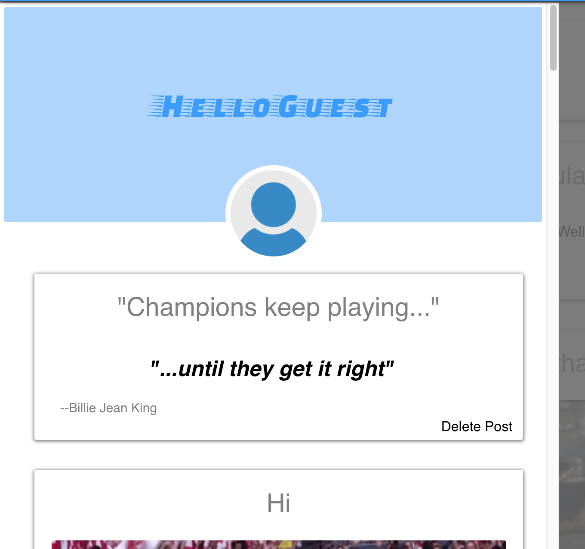
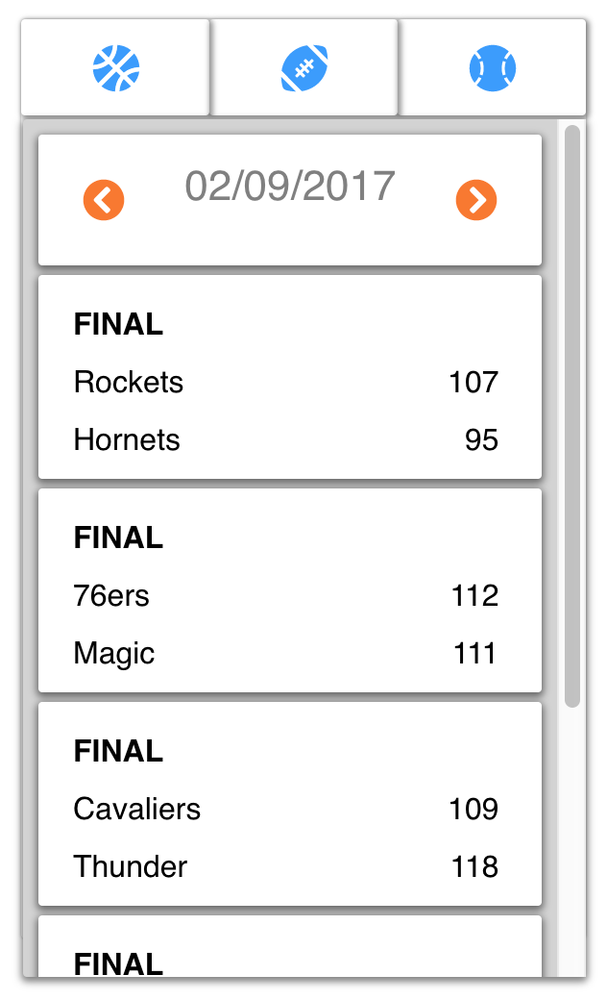
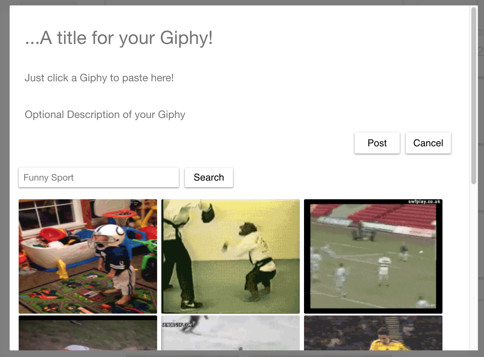

# Fümblr

[Fümblr](https://fumblrr.herokuapp.com/)

* Fümblr is a Full-Stack application that utilizes a React-Redux front end and a Postgresql, Ruby on Rails backend! This application was built and implemented from scratch within a 10 day deadline. My route for this project was atypical because I did not copy tumblr's design nor did I do a pixel perfect clone of their website. I chose to take my own route and design/style it to my own liking. Hope you enjoy!!

  * This site is a clone (with a twist) of the social media/blogging site tumblr. My focus for this application is what is viral in ALL of the sports world and use this inspiration to put my own sports twist on tumblr, allowing users to post text, quotes, photos, and any funny memes or gifs that tend to go viral in the sports world. My focus is on what is viral in ALL of the sports world.

***

# Features

* Live Version Hosted on Heroku
* User Authentication and Demo functionality
* Various Types of Posts
* NavBar with links to major sports websites
* Current User's show page displaying all of their own posts

  * 

* A feed of all users and their posts
* A SportsHub with Real-Time Scores

***

# Real Time Scores

* My application is unique from tumblr because of its Real-time sports API which displays scores for Major Sports leagues. However, currently it is a free api, therefore I am unable to access the array of sports and various data I would like to display (such as the WNBA, Womens Soccer, Tennis). Also, because it is currently a free API, only scores that are not of the current year may be displayed.

* Using this free API, every time the `ScorePanel` is rendered, an `$.ajax` request is made to the API to retrieve the current scores for the desired sport. Using some logic, I was able to allow the user to click the arrows and change the date which then triggers a re-rendering of the new date's current scores.

***

# Posts (with Giphy API)

* Again, Fümblr allows users to post text posts such as statuses or whatever may be on the user's mind as well as empowering, funny, or any variety of quotes authored by famous sports idols such as Serena Williams or of the user. My focus was to allow users to share what is viral in the sports world (such as topics on reddit.com/r/sport_name) so all of the posts may contain links to memes or gifs.
  * All the posts are retrieved within the Rails `PostController` and rendered on the `FeedIndex` view.
  * Users may choose from one of four Post types:
    * A `TextItem` which would most likely be used for a status post or any annotation on the users mind.
    * A `QuoteItem` which will format their quote within quotations and leading periods when posted.
    * A `PostItem` which is formatted differently so the photo is highlighted within the post and not their title.
    * Finally a `GifItem` which utilizes a gif search API within the `GiphysSearch` (powered by Giphy) so that users may choose to their liking.

***

# Ideas for the Future

## Activate a free-trial of a Real-Time Score API

  * This will provide the necessary data needed to display the Date, RealTime Scores, and Other sports such as WNBA, Both Womens and Mens Tennis matches, etc..

## Member to Member Messages

  * Implement a messaging feature allowing users to communicate with each other just like on the tumblr website.
